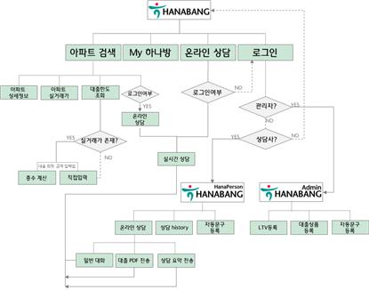
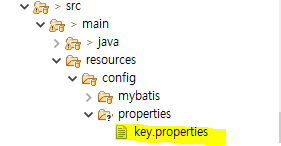
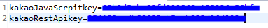
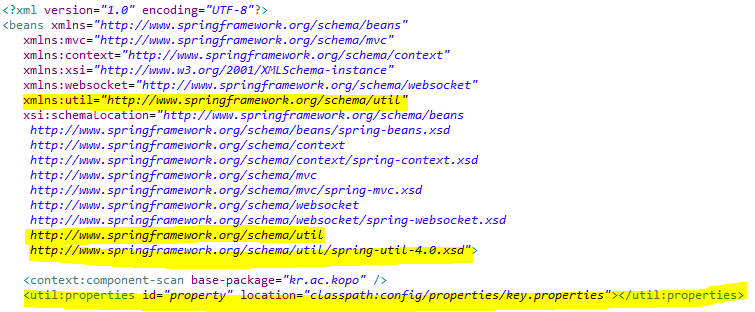
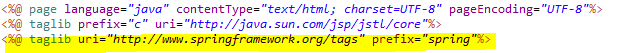
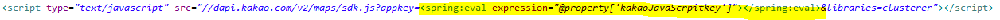
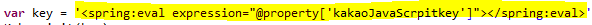

# Hanabang

[프로젝트 홈페이지 - https://koposoftware.github.io/2020_1_hjkim/](https://koposoftware.github.io/2020_1_hjkim/)

# 1. 프로젝트 개요

 하나방은 국토교통부의 오픈 API를 이용하여 부동산 실거래가에 관련한 정보를 제공하는 웹 사이트이다. 
 
 금융 웹 프로젝트에 맞게 아파트에 관한 대출한도 조회를 할 수 있으며, 대출 관련 온라인 상담을 할 수 있는 서비스 이다. 


 타행사인 국민은행은 Liiv on이라는 부동산 서비스를 운영하고 있으며, 우리은행은 아파트담보대출가능금액조회 서비스를 운영하고 있다. 
 하나은행은 하나라운지 안의 [골드 클럽]에 들어가면 부동산 전문가가 컨설팅을 도와주지만 이외에는 부동산 관련 서비스가 없다.


 가계 대출의 비중 중 주택담보대출이 차지하는 비율이 상당수이기 때문에 고객에게 정보 제공하는 것이 필요하다고 생각하였다. 
 또한 주택담보대출과 관련한 편리한 서비스(온라인 상담, 대출 한도 조회)를 제공해야 한다고 생각했기에 하나방을 기획하게 되었다.

<br>
<br>
<br>

# 2. 프로젝트 제안서
 <br> 
### [🤩Hanabang 제안서](./gitDoc/제안서.pptx) <br> <hr>
### ❤ WorkFlow <br>
   
<br>
<br>
<br>
   
# 3. 프로젝트 결과

 <br> 
### [🤩Hanabang 발표자료](./gitDoc/최종프로젝트발표.pptx) <br>

## 시연 동영상 

   <iframe id="ytplayer" type="text/html" width="640" height="360" src="https://www.youtube.com/embed/wZgTAmqRRF4" frameborder="0"></iframe>

# 4. 본인 소개

|이름 |김혜주||
|연락처 | hyeju.aa(@)gmail.com|
|skill set| Frontend - HTML, CSS, Javascript|
| | Backend - Java, Spring, Oracle|
|자격증| sqld, 정보처리기사 |
|수상| 입선- ICT 한이음 공모전(QR코드를 이용한 유통기한 관리 애플리케이션) | 
|특기사항| 2019년.03월 ~ 2019년 12월 (동아리활동- 멋쟁이 사자처럼 : Django를 이용합 웹 어플리케이션 개발, React-native를 이용한 어플리케이션 개발) <br>
           2019년.04월 ~ 2019년 11월 (06개월) ICT 한이음 멘토링 |

# 5. 기타

### ❤ 데이터 베이스 구축과정
<details>
  <summary style="">
     자세히보기
  </summary>
<div markdown="1">

> ## ✔개발환경
>  - python, jupyther notebook

 ## 😎아파트 기본정보
```python
import urllib.request
from bs4 import BeautifulSoup
import time
import pandas as pd
from pandas import DataFrame as df
import openpyxl

def getaptdata(loadCode):
    key = "-"
    url = "http://apis.data.go.kr/1611000/AptListService/getLegaldongAptList?bjdCode="+loadCode+"&serviceKey="+key
    try:
        f = urllib.request.urlopen(url)
    except Exception as e:
        print('Fail ' + str(e))
        time.sleep(100)
        f = urllib.request.urlopen(url)


    aptxml = f.read().decode("utf8")
    f.close()
    soup = BeautifulSoup(aptxml, "lxml")
    aptdata = []
    for item in soup.find_all("item"):
        aptdataAll = [loadCode, item.find("kaptcode").get_text(), item.find("kaptname").get_text()]
        aptdata.append(aptdataAll)
        print(aptdata)
    return(aptdata)

apt = []
wb = openpyxl.load_workbook('C:/Lecture/프로젝트/최종프로젝트/데이터베이스구축/법정동코드.xlsx')
ws = wb['법정동코드 전체자료']
print("test")
cells = ws['A2':'A20525']

workbook = openpyxl.Workbook()
sheet = workbook.active
sheet.append(["bjdCode", "kaptCode","kaptName"])
for row in cells :
    for cell in row:
        print(cell.value)
        test = getaptdata(str(cell.value))
        if test :
            for x,y,z in test :
                check = [x,y,z]
                print(check)
                sheet.append(check)
            workbook.save('C:/Lecture/프로젝트/최종프로젝트/데이터베이스구축/아파트기본정보.xlsx')
print("finish")
```

   
## 😎아파트 상세정보

```python  
import urllib.request
from bs4 import BeautifulSoup
import time
import pandas as pd
from pandas import DataFrame as df
import openpyxl

def getaptdata(kaptCode):
    key = "openAPI KEY"
    url = "http://apis.data.go.kr/1611000/AptBasisInfoService/getAphusBassInfo?kaptCode="+kaptCode+"&serviceKey="+key
    try:
        f = urllib.request.urlopen(url)
    except Exception as e:
        print('Fail ' + str(e))
        time.sleep(100)
        f = urllib.request.urlopen(url)


    aptxml = f.read().decode("utf8")
    f.close()
    soup = BeautifulSoup(aptxml, "lxml")
    item = soup.find("item")
    aptdataAll = []
    aptSearch = ["bjdcode", "codehallnm", "codeheatnm", "codesalenm","hocnt", "kaptacompany", "kaptaddr", "kaptbcompany"
                 , "kaptcode", "kaptdongcnt", "kaptfax", "kaptmarea", "kaptmparea_135", "kaptmparea_136", "kaptmparea_60"
                 , "kaptmparea_85", "kaptname", "kapttarea", "kaptdacnt", "privarea", "kapturl", "dorojuso", "codeaptnm"
                 , "codemgrnm", "kapttel", "kaptusedate"]

    for aptOne in aptSearch :
        try:
            aptdataAll.append(item.find(aptOne).get_text())
        except AttributeError as e:
            aptdataAll.append('-')
            pass


    return(aptdataAll)

apt = []
wb = openpyxl.load_workbook('C:/Lecture/프로젝트/최종프로젝트/데이터베이스구축/2.아파트기본정보.xlsx')
ws = wb['Sheet']
cells = ws['B2':'B11340']

workbook = openpyxl.Workbook()
sheet = workbook.active
sheet.append(["bjdcode", "codehallnm" ,"codeheatnm" 
              ,"codesalenm","hocnt"
              ,"kaptacompany","kaptaddr","kaptbcompany", "kaptcode","kaptdongcnt","kaptfax",
              "kaptmarea","kaptmparea_135","kaptmparea_136","kaptmparea_60",
              "kaptmparea_85","kaptname","kapttarea","kaptdacnt","privarea",
              "kapturl","dorojuso","codeaptnm","codemgrnm","kapttel","kaptusedate"])

for row in cells :
    for cell in row:
        aptInfoAll = getaptdata(str(cell.value))
        if aptInfoAll :
            print(aptInfoAll)
            sheet.append(aptInfoAll)
            workbook.save('C:/Lecture/프로젝트/최종프로젝트/데이터베이스구축/아파트상세정보.xlsx')
```

## 😎아파트 LAT LNG
```python
# 아파트 상세 정보 출력 코드
import urllib.request
from bs4 import BeautifulSoup
import time
import pandas as pd
from pandas import DataFrame as df
import openpyxl

def getLatLng(addr) :
    url = 'https://dapi.kakao.com/v2/local/search/address.json?query=' + addr
    headers = {"Authorization": "KakaoAK 354135ccdb89653ab5ecb933d96d903a"}
    global latlng
    try:
        result = json.loads(str(requests.get(url, headers=headers).text))
        latlng = []

    except Exception as e:
        print('Fail ' + str(e))
        time.sleep(100)
        result = json.loads(str(requests.get(url, headers=headers).text))
    try:
        match_first = result['documents'][0]['address']
        latlng =[float(match_first['y']), float(match_first['x'])]
    except IndexError as e:
        latlng=['-','-']
        
    return latlng

apt = []
wb = openpyxl.load_workbook('C:/Lecture/프로젝트/최종프로젝트/데이터베이스구축/3.아파트상세정보.xlsx')
ws = wb['Sheet']
cells = ws['B2':'G11340']

workbook = openpyxl.Workbook()
sheet = workbook.active
sheet.append(["lat","lan"])

latlngSave=""
for row in cells :
    for cell in row:
        print(cell.value)
        latlngSave = getLatLng(str(cell.value))
        if latlngSave :
            sheet.append(latlngSave)
            workbook.save('C:/Lecture/프로젝트/최종프로젝트/데이터베이스구축/아파트상세정보-위경도.xlsx')
print("finish")
```

</div>
</details>

### ❤ api key값 properties파일로 관리
<details>
   <summary style="">
      자세히보기
   </summary>
 <div markdown="1">
   
#### 1. properties파일을 만든다. __[src/main/resources/config/properties/key.properties]__
&nbsp;  <br>
&nbsp; __[key.properties]파일 내부__ <br>
&nbsp; 

#### 2. spring-mvc 파일을 수정한다. __[src/main/resources/config/spring/spring-mvc.xml]__
&nbsp; 

#### 3. Properties안에 들어있는 값을 사용하려는 jsp의 상단에 taglib 추가한다. 
&nbsp; 

#### 4. 다음과 같이 사용하려는 위치에서 <spring:eval></spring:eval>을 사용한다.
&nbsp; 
&nbsp; or
&nbsp; 

</div>
</details>
